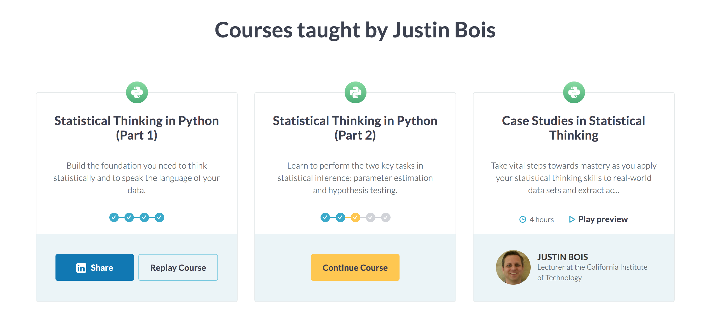

### Statistical Thinking in Python

This repository contains the learnings I have gathered from the following courses in Datacamp:

1. Statistical Thinking in Python (Part 1)
2. Statistical Thinking in Python (Part 2)
3. Case Studies in Statistical Thinking

