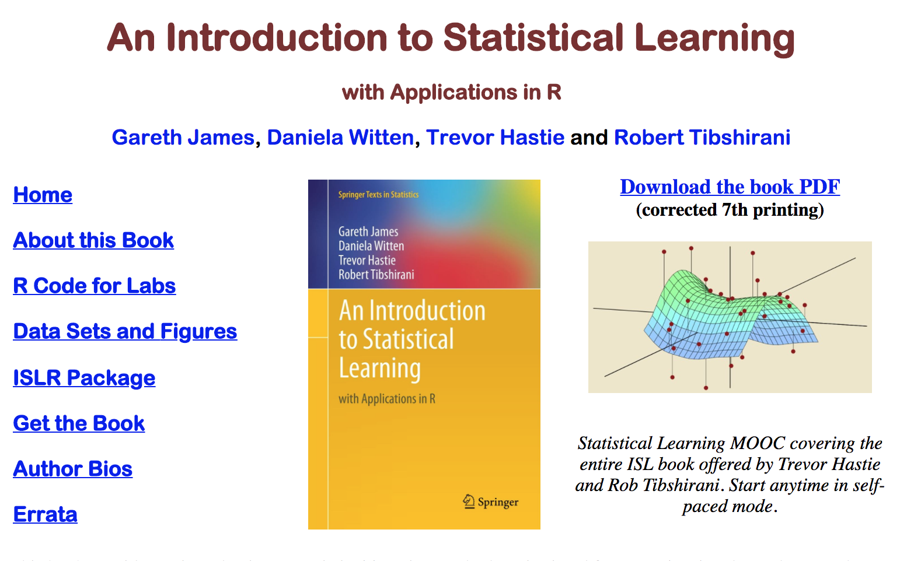

### Introudction to Statistical Learning

This repository contains the learnings I have gathered from the book Introduction to Statistical Learning

It contains notebooks for each of the chapter end applied and conceptual questions. I have used the language Python to answers the questions.

The book covers mainly supervised learning, with a focus on regression and classification methods. The syllabus includes: 
1. linear and polynomial regression
2. logistic regression
3. linear discriminant analysis
4. cross-validation and the bootstrap
5. model selection and regularization methods (ridge and lasso)
6. nonlinear models, splines and generalized additive models
7. tree-based methods
8. random forests and boosting
9. support-vector machines
10. Some unsupervised learning methods are discussed: principal components and clustering (k-means and hierarchical).

